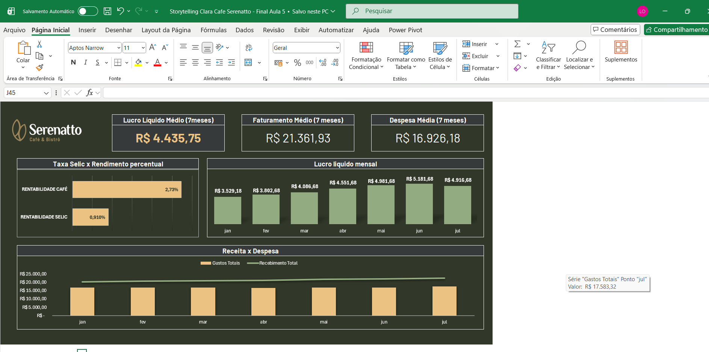

# Portfólio de Business Intelligence - Guilherme Lima

Bem-vindo ao meu portfólio de dados. Abaixo estão os projetos desenvolvidos com foco em análise de performance, KPIs financeiros e estratégia de negócios.

---

# 🐾 Dashboard de Análise de Vendas - Gatito Petshop

## 📝 Sobre o Projeto
Este foi meu primeiro projeto completo em Power BI. O objetivo foi criar um painel gerencial para um Petshop fictício, permitindo o acompanhamento de KPIs de faturamento, vendas e ticket médio.

Apesar de ser um cenário de Varejo, este projeto consolidou minha base técnica para a transição de carreira para **Análise de Desempenho Esportivo**, focando em tratamento de dados e visualização estratégica.

## 🛠️ Tecnologias Utilizadas
* **Power BI Desktop:** Modelagem de dados e visualização.
* **Figma/Canva:** Design de background e layout (UI/UX).
* **Power Query:** Limpeza e transformação da base de dados (ETL).
* **DAX:** Criação de medidas para totais, médias e inteligência de tempo.

## 🧠 A Lógica: Do Varejo para o Esporte
Como engenheiro em transição para a área esportiva, a lógica aplicada aqui é diretamente transferível:

| Contexto Petshop (Atual) | 🔄 Tradução para Futebol / E-sports |
| :--- | :--- |
| **Faturamento por Bairro** | **Mapa de Calor de Torcida** ou **Gols por Zona do Campo** |
| **Evolução de Vendas (Linha)** | **Carga de Treino (GPS)** ou **Curva de Ouro (LoL)** |
| **Filtros de Marca/Data** | **Filtros de Temporada/Campeonato** |
| **Busca de Produto** | **Scout Individual de Jogador** |

## 🖥️ Visualização
> **[CLIQUE AQUI PARA ACESSAR O DASHBOARD ONLINE] ("https://app.powerbi.com/view?r=eyJrIjoiYmYxYzJlNzctMzI3Zi00OGNjLWI5ZWEtZDc2ZTY0OTRlNTY1IiwidCI6IjUyMmY1N2FhLWRjMTEtNDhjZS1iN2ZlLWYxNGZiMTQ4MDRjYyJ9")**

## 🚀 Funcionalidades
- **Navegação Intuitiva:** Uso de botões e segmentação de dados.
- **Storytelling Visual:** Layout personalizado para facilitar a leitura rápida de métricas chaves.
- **Análise Temporal:** Monitoramento de performance mensal e trimestral.

---

## 2. Case Café Serenatto (Gestão Financeira)
**Foco:** Análise de produtividade da equipe e eficiência operacional.

> **Destaques:**
> * Comparativo de rentabilidade do negócio x Investimentos (Selic).
> * Análise detalhada de custos de contratação (PF vs PJ).
> * Data Storytelling aplicado para facilitar a tomada de decisão da diretoria.

---

### 🛠 Ferramentas Utilizadas
* **Microsoft Power BI** (DAX, Power Query, Visualização)
* **Excel Avançado** (Tratamento de dados)
